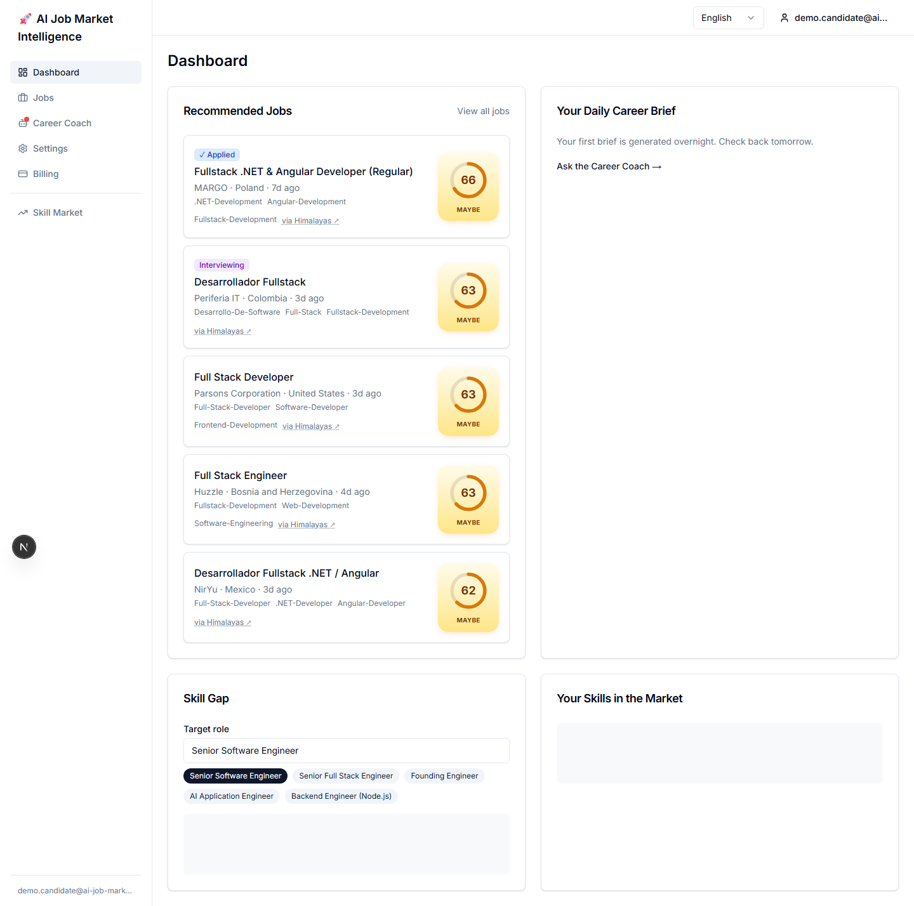
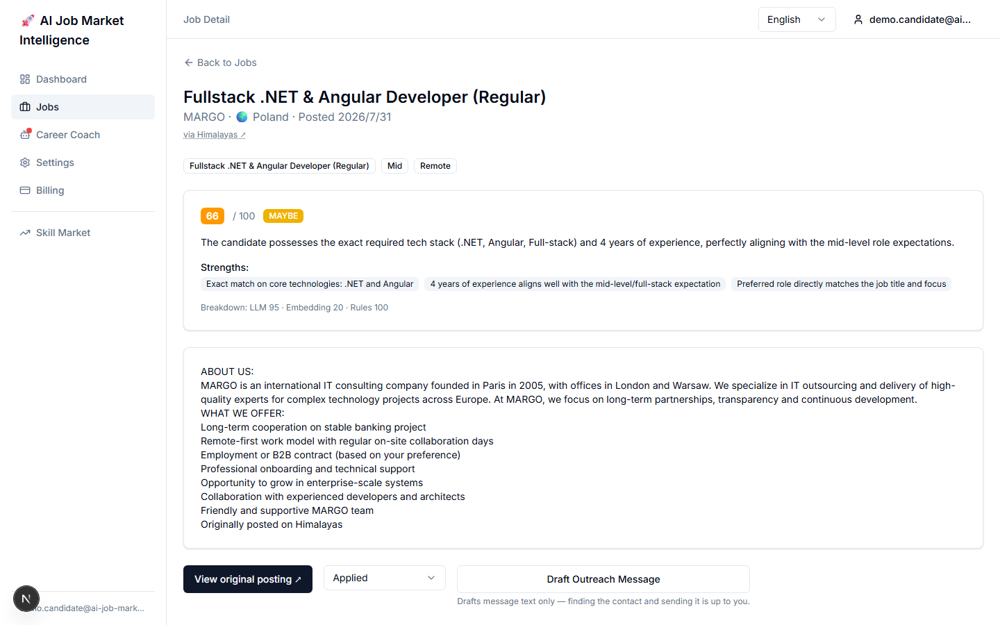
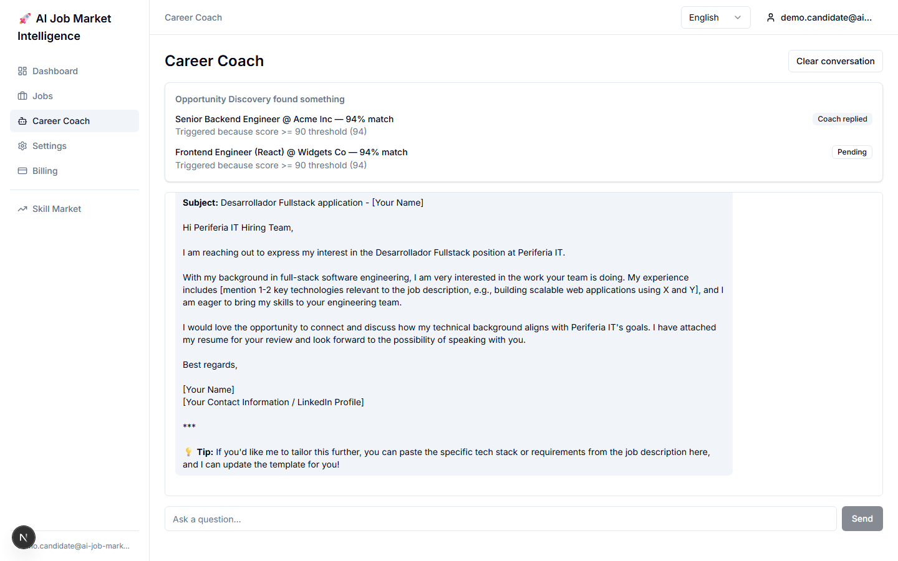
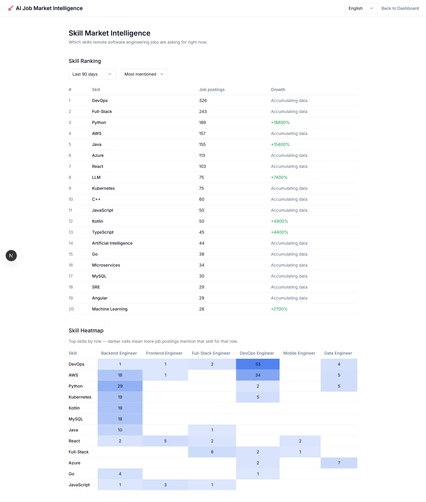
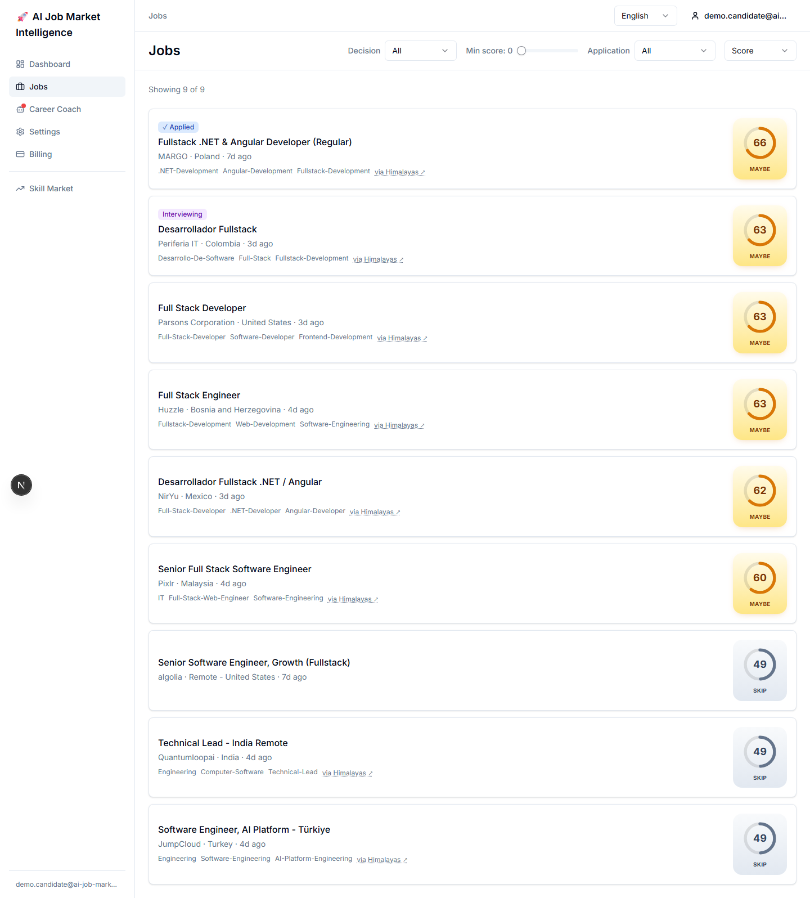

<div align="center">

# AI Job Market Intelligence

**一个 AI 驱动的职业市场情报平台** —— 从合规数据源持续抓取远程职位，用 LLM 把职位描述解析成结构化字段，再用混合 AI 评分模型把职位和你的画像做匹配，并解释"为什么匹配"、"还差什么技能"。

[English](./README.md) | [中文](./README.zh.md)


**[在线体验 →](https://ai-job-market-intelligenceweb-production.up.railway.app)**

</div>

---

## 界面预览

|                                                                                                                                                                                             |                                                                                                                                                    |
| ------------------------------------------------------------------------------------------------------------------------------------------------------------------------------------------- | -------------------------------------------------------------------------------------------------------------------------------------------------- |
|  **仪表盘** —— 按你的画像评分后的职位、申请状态一览，以及针对目标岗位的实时技能缺口分析。                                                            |  **职位详情** —— 混合评分拆解为 LLM / 向量相似度 / 规则三个子分，还能针对这条职位生成 AI 主动联系文案草稿。 |
|  **Career Coach** —— 职位评分 ≥ 90 时，Opportunity Discovery 会实时把用户交接给 Career Coach，由它主动发起对话，时间线上能看到完整的触发原因。 |  **技能市场情报** —— 基于实时职位池计算的技能需求排行榜与技能 × 岗位热力图。                          |

<details>
<summary>职位列表</summary>



</details>

以上截图均来自一个演示账号，展示的是真实评分/Career Coach 流水线未经编辑的原始输出（不是写死的示例文案）——欢迎点击[在线体验](https://ai-job-market-intelligenceweb-production.up.railway.app)自己试一遍。

---

## 这是什么

上传简历或关联 GitHub 之后，平台会：

1. 持续从 **5 个 Tier-1 合规数据源** 抓取职位（只用官方公开 API，不抓 LinkedIn/Indeed/Glassdoor 这类 ToS 明确禁止抓取的平台）
2. 对每条职位跑 **LLM 结构化解析**，从自由文本描述里提取角色/资历/技能/薪资区间/远程政策等字段
3. 用 Embedding 相似度做 **跨源去重**——同一份职位出现在多个数据源时不会重复展示
4. 用 **混合评分模型**（LLM 推理 + Embedding 相似度 + 规则信号）给每条职位打分，输出匹配分数、结构化的"优势/不足"解释，以及技能缺口分析
5. 出现高匹配职位时通过邮件通知，同时在站内通过 Opportunity Discovery 和 Daily Brief 展示
6. 交接给 AI Career Coach —— 一个支持工具调用的对话助手，可以查询职业路径、技能趋势、薪资区间；出现突出匹配（分数 ≥ 90）时会主动开启对话

这是一个 Monorepo 项目，全站中英双语，AI 部分默认走 [OpenRouter](https://openrouter.ai) 的免费模型，尽量把运行成本压到最低。

> **提示**：在线演示的支付走的是 **Stripe 测试环境（Test Mode）**——"升级到 Pro"流程不会产生真实扣款，只接受 Stripe 的测试卡号，例如：
>
> | 场景         | 卡号                  | 有效期 / CVC / 邮编                          |
> | ------------ | --------------------- | -------------------------------------------- |
> | 支付成功     | `4242 4242 4242 4242` | 任意未来日期 / 任意 3 位数字 / 任意 5 位数字 |
> | 支付被拒绝   | `4000 0000 0000 0002` | 同上                                         |
> | 需要 3D 验证 | `4000 0025 0000 3155` | 同上                                         |
>
> 完整列表见 [Stripe 官方测试文档](https://docs.stripe.com/testing)。

## 核心功能

- **Email Magic Link 登录** —— 无密码，基于 Auth.js v5 + Resend
- **职业画像** —— 手填技能 + 简历上传（LLM 解析）+ GitHub 公开信息解析（语言分布、README 摘要），三者合并成一份画像，带异步解析状态反馈（处理中/成功/失败）
- **合规的多源职位抓取** —— RemoteOK、Greenhouse、Lever、Ashby、Himalayas；针对 Greenhouse/Lever/Ashby 这三个 ATS 平台的公司发现完全免费、零配置（基于 Common Crawl 公开索引查询），不需要任何付费 Search API
- **AI 结构化职位解析** —— 从原始职位描述中提取角色/资历/技能/薪资/远程政策，并给出置信度
- **跨源去重** —— 同一份职位出现在多个招聘板时通过 Embedding 相似度合并，不会当成不同职位重复展示
- **混合 AI 评分** —— LLM + Embedding + 规则信号，输出结构化的"优势/不足"解释，而非一个不透明的分数
- **技能缺口分析** —— 对比你的技能和目标岗位所需技能
- **Skill Intelligence** —— 全市场技能需求排行榜和技能共现热力图（`/market/skills`）
- **AI Career Agent** —— 每日匹配职位摘要（Daily Brief）、实时高匹配提醒（Opportunity
  Discovery）、支持工具调用的 Career Coach 对话助手（职业路径推荐、技能趋势、薪资区间查询）
- **多 Agent 交接** —— 职位对你的匹配分数 ≥ 90 时，Opportunity Discovery 自动交接给
  Career Coach，由其针对这个匹配主动开启对话
- **基于内容指纹的增量抓取** —— 内容未变化的职位跳过重新解析和重新生成 Embedding，控制 LLM 调用成本
- **职位下架检测** —— 公司招聘板上已撤下的职位会被标记为关闭，而不是永远挂在列表里
- **Free / Pro 订阅套餐**（Stripe，在线演示为测试模式）
- **中英双语界面**（next-intl，英文默认）

## 技术栈

| 层          | 选型                                                                                                                                                   |
| ----------- | ------------------------------------------------------------------------------------------------------------------------------------------------------ |
| 前端        | Next.js 15（App Router）、TypeScript、shadcn/ui + Tailwind CSS、TanStack Query v5                                                                      |
| 后端        | Next.js Route Handlers、Prisma、Zod                                                                                                                    |
| 队列/Worker | BullMQ + Redis                                                                                                                                         |
| 数据库      | PostgreSQL 16 + `pgvector`（职位/画像向量）                                                                                                            |
| AI          | [OpenRouter](https://openrouter.ai) —— LLM（`google/gemma-4-26b-a4b-it:free`）+ Embedding（`nvidia/llama-nemotron-embed-vl-1b-v2:free`），成本优先设计 |
| 认证        | Auth.js v5（Resend Email Magic Link）                                                                                                                  |
| 支付        | Stripe（Free / Pro，在线演示为测试模式）                                                                                                               |
| 多语言      | next-intl（`en` 默认 / `zh`）                                                                                                                          |
| 测试        | Vitest（单元）+ Playwright（E2E）                                                                                                                      |
| CI          | GitHub Actions                                                                                                                                         |
| 部署        | Railway（单一项目：Postgres + Redis + Worker + Web）                                                                                                   |

## 架构

Monorepo，pnpm workspaces + Turborepo 管理：

```
ai-job-market-intelligence/
├── apps/
│   ├── web/            # Next.js 应用 —— 前端 + REST API 路由
│   └── worker/         # BullMQ Worker —— 抓取、AI 解析、评分、通知
├── packages/
│   ├── db/             # Prisma schema + 生成的 client（数据模型唯一权威定义）
│   ├── shared/         # 共享类型/schema、数据源 adapter、队列定义
│   └── ai/             # LLM Prompt、混合评分、Embedding、简历/GitHub 解析
└── docker-compose.yml   # 本地 Postgres（pgvector）+ Redis
```

职位是**平台级共享资源**（不是按租户隔离），所有用户对同一批职位数据打分，抓取成本不随用户数增长。没有组织级多租户——这是一个 B2C、账号即个人的产品。

### 数据流水线（概览）

```
Company Discovery（每周一次，零配置，基于 Common Crawl）
  → 为 Greenhouse/Lever/Ashby 发现候选公司并写入库
       ↓
Ingestion Cron（每个数据源独立调度）
  → 抓取 → 标准化 → 过滤（远程/近期/非垃圾信息）
       ↓
AI Job Parsing（LLM 结构化提取；原生已有结构化字段的源跳过 LLM）
  → 生成 Embedding
  → 跨源去重（Embedding 相似度）
  → 写入 jobs 表
       ↓
评分（混合 LLM + Embedding + 规则模型，针对每个活跃用户）
  → 分数够高则发送邮件通知（仅 Pro 用户）
  → Opportunity Discovery + Daily Brief（站内展示）
  → 分数 ≥ 90 → Agent Handoff → Career Coach 主动开启对话
```

### 合规立场

新增数据源前必须先做分级：

- **Tier 1（已采用）** —— 明确允许程序化访问的官方公开 API：RemoteOK、Greenhouse、Lever、Ashby、Himalayas
- **Tier 2（逐个评估）** —— 没有官方 API 的公开网页，接入前必须检查 `robots.txt`/ToS
- **Tier 3（永久禁止）** —— ToS 明确禁止自动化访问，或有过抓取相关诉讼先例的平台（LinkedIn、Indeed、Glassdoor）。无论需求多大，这些平台永远不抓。

## 快速开始

### 前置条件

- Node.js ≥ 20
- pnpm ≥ 9
- Docker（本地跑 Postgres + Redis）

### 启动步骤

```bash
git clone https://github.com/<your-username>/ai-job-market-intelligence.git
cd ai-job-market-intelligence
pnpm install

docker compose up -d

cp apps/web/.env.example apps/web/.env.local
cp apps/worker/.env.example apps/worker/.env
# 至少需要填入：OPENROUTER_API_KEY、RESEND_API_KEY

pnpm db:migrate
pnpm db:seed
pnpm dev
```

- Web：http://localhost:3000
- Worker 健康检查：http://localhost:3001
- Prisma Studio：`pnpm db:studio`

职位抓取（公司发现、AI 解析、评分）除了 `OPENROUTER_API_KEY` 和 `RESEND_API_KEY` 之外**不需要任何其他外部 API Key**——针对 ATS 数据源的公司发现走免费公开的 Common Crawl 索引，不需要 Search API Key。

### 常用命令

| 命令                           | 说明                               |
| ------------------------------ | ---------------------------------- |
| `pnpm dev`                     | 同时启动 Web + Worker（开发模式）  |
| `pnpm build`                   | 构建所有 app/package               |
| `pnpm lint` / `pnpm typecheck` | 对整个 Monorepo 做 Lint / 类型检查 |
| `pnpm test`                    | 跑单元测试（Vitest）               |
| `pnpm test:e2e`                | 跑 E2E 测试（Playwright）          |
| `pnpm db:migrate`              | 应用 Prisma migration（开发环境）  |
| `pnpm db:studio`               | 打开 Prisma Studio                 |

## 部署

全部跑在同一个 [Railway](https://railway.app) 项目里，四个服务：

- **Postgres**（自定义 `pgvector/pgvector:pg16` 镜像，不用 Railway 内置的 Postgres 插件——插件默认镜像不保证带 pgvector 扩展）+ **Redis**，作为 Database 资源
- **Worker** 和 **Web** 直接连接 GitHub 仓库，用 Railway 的 Railpack 构建器（`pnpm --filter <package> build`/`start`），push 到 `master` 自动重新构建部署。Worker 需要持久化进程常驻（BullMQ 需要原生 TCP Redis 连接 + 持续运行的 repeatable job），所以是 Railway 的常驻服务，不是 Serverless Function
- 四个服务在同一个 Railway 内网里，Worker/Web 用内网地址连 Postgres/Redis，不走公网
- **CI**（GitHub Actions）在每次 push/PR 时跑 lint → typecheck → test → build，并在 `master` 分支上执行数据库 migration（Railway 自己的 GitHub 集成负责实际的服务部署，跟这个 workflow 是各自独立触发的）

## License

[MIT](./LICENSE)
